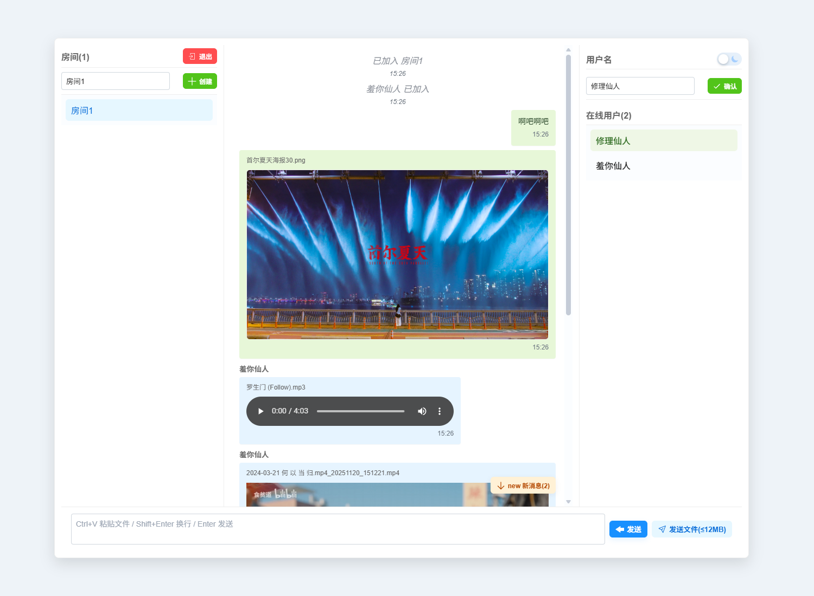
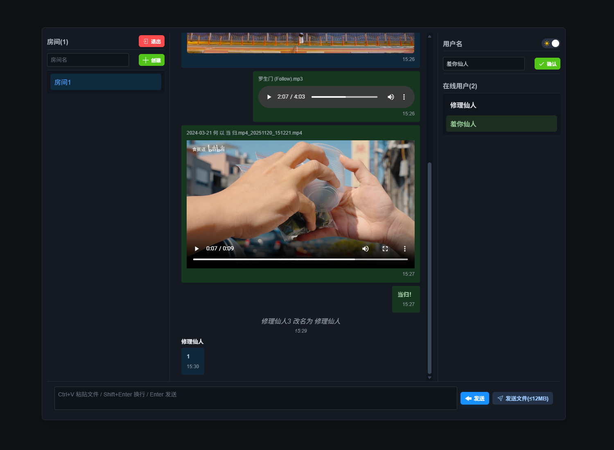

# 💬 局域网文字聊天 web 应用




## 环境配置

### 🖥️ 系统要求

- Python 3.8+
- 支持 WebSocket 的现代浏览器

### 📦 安装依赖

1. 创建 Python 虚拟环境：

   ```bash
   python -m venv venv
   ```

2. 激活 Python 虚拟环境：

   ```bash
   venv\Scripts\activate
   ```

3. 在激活的虚拟环境中安装依赖：

   ```bash
   pip install -r server/requirements.txt
   ```

   > **注意**：必须在虚拟环境激活状态下安装依赖，确保包安装到虚拟环境中而不是全局 Python 环境。

### ⚙️ 环境变量配置（可选）

在项目根目录创建 `.env` 文件来配置环境变量：

```text
# 允许的跨域源，默认为 *
CORS_ORIGINS=*

# 单条消息最大字节数，默认为 16777216 (16MB)
MAX_MESSAGE_BYTES=16777216

# 静态资源缓存时间（秒），默认为 86400 (24小时)
STATIC_CACHE_SECONDS=86400
```

## 🚀 如何启动

1. 激活虚拟环境（未激活）：

   ```bash
   venv\Scripts\activate
   ```

2. 根目录运行主程序：

   ```bash
   python -m server.main
   ```

   开发环境启动（支持自动重载）：

   ```bash
   uvicorn server.app:app --host 0.0.0.0 --port 12345 --reload
   ```

3. 打开浏览器访问 `http://localhost:12345` 或 `http://127.0.0.1:12345`

服务器将在 `0.0.0.0:12345` 上启动，支持局域网访问。

## ✨ 支持的功能

- 💬 **实时文字聊天**：基于 WebSocket 的实时文本消息传输
- 🏠 **多房间支持**：创建和加入不同的聊天房间
- 👥 **在线用户**：实时显示房间内的在线用户
- 📁 **文件传输**：支持在聊天中发送小文件
- 🌙 **主题切换**：支持明暗主题切换

## 📂 文件夹结构

```text
lan-text-web-chat/
├── README.md                 # 项目说明文档
├── server/                   # 后端服务器代码
│   ├── app.py               # FastAPI应用工厂
│   ├── config.py            # 配置文件和工具函数
│   ├── constants.py         # 常量定义和验证规则
│   ├── helpers.py           # 辅助函数
│   ├── logging_setup.py     # 日志配置
│   ├── main.py              # 应用启动入口
│   ├── requirements.txt     # Python依赖列表
│   ├── rooms.py             # 房间管理逻辑
│   └── routes.py            # HTTP和WebSocket路由定义
└── view/                    # 前端静态资源
    ├── index.html           # 主页面HTML
    ├── icon/                # 图标资源
    └── js/                  # JavaScript模块
    │   ├── config.js        # 前端配置
    │   ├── main.js          # 主入口脚本
    │   ├── messages.js      # 消息处理
    │   ├── panels.js        # 面板管理
    │   ├── transport.js     # WebSocket通信
    │   └── utils.js         # 工具函数
    └── style/               # CSS样式文件
        ├── base.css         # 基础样式
        ├── components.css   # 组件样式
        ├── controls.css     # 控制元素样式
        ├── index.css        # 主样式入口
        ├── layout.css       # 布局样式
        └── vars.css         # CSS变量定义
```
